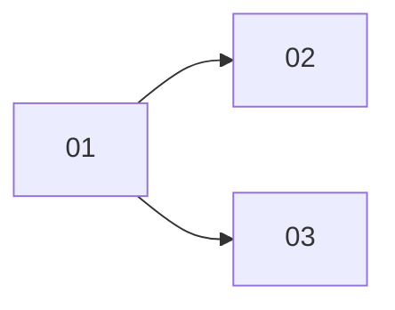

# Session artifacts on the Home feed cards

> Working plan — temporary, committed on the feature branch. Deleted once the feature ships.

**Issue:** https://github.com/dam-agents/dam/issues/3432

## Goal

A Home feed card shows the artifacts the session produced, as chips the user can click to open the
existing preview dialog. Only artifacts touched since the user last engaged with that card appear,
so the card says what is new rather than indexing everything the session ever wrote.

## Approach

Artifacts already carry `agentId`. Nothing carries the **session**, and nothing can: the harness
calls the platform's MCP server directly, that endpoint's context is the agent alone, and the
agent-runtime does not proxy MCP. See [artifact-library](../../architecture/artifact-library.md).

Attribution therefore comes from the one place that already records it deterministically — **the
session's own tool-call stream**. When the agent calls an artifact tool, the harness reports the
call and its result on `session/update` frames tagged with the session id, and the agent-runtime
already proxies and stores those frames as session history
(`packages/agent-runtime/src/modules/acp/infrastructure/history-provider.ts`). The result content
of `create_artifact` and `update_artifact` already carries the artifact id. So the runtime can
observe a touch and report `(session, artifact)` to the platform without inference, without the
model supplying anything, and without changing what the platform sends the harness.

Three properties this design rests on, each verified against
`@agentclientprotocol/claude-agent-acp@0.66.0` as pinned in
`packages/agents/claude-code/harness-tools.toml`:

- **Tool calls are always reported.** The adapter's `shouldEmitToolCall` suppresses only
  `TodoWrite` and the `Task*` tools; MCP tools are always emitted.
- **Results reach the stream.** `tool_call_update` carries `status` and `rawOutput` holding the
  tool's own result content.
- **Frames are session-tagged.** Every `session/update` frame carries its `sessionId`.

That pin is the real guard against drift. A unit test cannot protect against the adapter changing
shape, so re-verification belongs to the version bump.

### Recognition is by payload, not by tool name

The runtime must not key off the tool's name: the harness invents the namespaced name, not us. The
artifact tools return their result through a `json()` helper
(`packages/api-server/src/modules/artifact-library/mcp-tools.ts:25`), so the result is already a
JSON text block carrying the artifact id. This feature adds a stable, versioned marker to that
payload for `create_artifact` and `update_artifact`, and the runtime recognises **any** tool result
containing the marker. A payload without it, or one that fails its schema, is dropped — the touch
is simply not recorded.

### Failure is always "no chip", never a wrong chip

Per [ADR-083](../../adrs/083-eventing-layering.md), anything crossing a process boundary is
schema-parsed on receipt and dropped on mismatch. Every failure mode here — an adapter that stops
reporting, a payload shape change, a lost report, a terminal session — results in a missing chip.
Nothing can attribute an artifact to the wrong session.

### Known gap: terminal sessions

Terminal mode runs the harness against a PTY and bypasses ACP entirely
([ADR-055](../../adrs/055-agent-owned-session-metadata.md)), so there are no frames to observe and
artifacts produced there stay unattributed. No option considered for this feature reaches TUI
sessions.

## Sub-issues

| #  | Title | Scope | Depends on |
|----|-------|-------|------------|
| 01 ✅ | Touch record, its two doors, and the tool marker | The table and migration, repository and service, a pod-facing ingest and an owner-facing read, and the marker on the two artifact tools | — |
| 02 | Runtime reports artifact touches | The runtime observes tool results on frames it already proxies, parses the marker, and reports touches | 01 |
| 03 | Chips on the feed card | Artifact chips on the card for touches newer than the session's `seenAt` | 01 |

02 and 03 are independent of each other; either can land first once 01 is in.

## Conventions & glossary

- **Touch** — one artifact version produced by one session. A creation and an edit are both
  touches; a creation is the touch whose version is 1.
- **Marker** — the versioned field in an artifact tool's JSON result that makes the payload
  self-identifying, so recognition never depends on the harness's tool naming.
- Apply `/typescript-engineering` for `packages/api-server`, `packages/api-server-api`,
  `packages/db` and `packages/agent-runtime`; apply `/react-ui-engineering` for `packages/ui`.
- Migrations for table changes are generated, never hand-written: `mise run db:generate`. Never
  invoke `pnpm`, `drizzle-kit`, `tsc` or `eslint` directly.
- The owner-facing read enforces the caller's agent binding **inside the query**, alongside the
  limit — not by filtering rows after the fact.

## Whole-feature smoke test

On a cluster with a running agent, from its chat: ask the agent to publish a short artifact, then
open Home. The session's card carries a chip named for that artifact, and clicking it opens the
preview dialog. Ask the agent to revise the same artifact and confirm the chip is still there once.
Open the session so the card is seen, prompt the agent to do something that touches no artifact,
and confirm the card returns with no chip.

## Delivery

Each sub-issue is one atomic commit. The whole feature lands as a single PR for
[#3432](https://github.com/dam-agents/dam/issues/3432).
