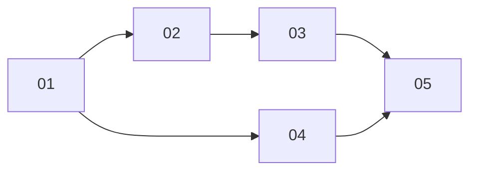

# Agent processes panel

> Working plan — temporary, committed on the feature branch. Deleted once the feature ships.

**Issue:** https://github.com/dam-agents/dam/issues/3584 (read the description and the grilling decision log in its comments)

## Goal

A user opens an agent and sees every long-running process in it: what runs now, what keeps
the agent awake, what stops at hibernation, and what finished while they were away, with its
output. They can stop any process and flip whether it keeps the agent awake. Leaving the
agent never stops anything by itself.

The rules, settled during grilling:

- **Leaving kills nothing.** Closing the tab or the browser stops no work.
- **Hibernation kills everything**, as today. Work that must outlive hibernation needs an
  *Always on* agent.
- **Only kept work keeps the agent awake.** The agent keeps work on purpose: as a Harness
  Task (Claude Code `run_in_background`) or as a Detached Process launched or marked with
  `platform-keep`. Unkept work survives leaving and dies at hibernation.
- **The user has the last word.** Any process can be stopped, or flipped between "keeps the
  agent awake" and "stops at hibernation". When the user and the agent disagree about one
  process, the user wins.
- **Settings don't kill kept work.** A new connection or a config change no longer forces a
  harness restart after 60 s while a kept Harness Task runs. The change waits, and the panel
  offers "Apply now".

Out of scope: per-session scope, a leave dialog, a follow-up turn when a Detached Process
finishes, exit codes, and any change to when agents hibernate.

## Approach

Read [agent-lifecycle](../../architecture/agent-lifecycle.md) first, especially "Session
inside the pod" (the pod service, catatonit wrapping agent-runtime) and "Hibernate" (the
`idle` flag, the blind spot of unreported work), then
[agent-processes](../../architecture/agent-processes.md) (reported background work and the
process inventory; split out of agent-lifecycle by 01, which had hit its size cap). Also read
[persistence](../../architecture/persistence.md) (runtime documents on the agent disk),
[runtime-delivery](../../architecture/runtime-delivery.md) and
[harness-config](../../architecture/harness-config.md) (env and config recycles), and
[features](../../architecture/features.md) (per-user flags).

**Everything lives in agent-runtime.** The runtime is the only component that sees the
process table. It gets a new `processes` module that:

1. **Scans** `/proc` and classifies processes (01).
2. **Holds keep decisions**: agent marks from `platform-keep` and user overrides (02).
3. **Feeds** kept work into `runtimeBusy()` in
   `packages/agent-runtime/src/modules/acp/services/acp-runtime/acp-runtime.ts`, the function
   behind the `idle` flag the controller's idle checker probes. Nothing in the controller
   changes.
4. **Exposes** a `processes` router on the agent-runtime tRPC surface
   (`packages/agent-runtime-api/src/router.ts`). The UI reaches it through the existing
   per-agent tRPC relay (`packages/ui/src/modules/agents/agent-trpc.ts` →
   `/api/agents/:id/trpc[-ws]` → the pod's `/api/trpc[-ws]`), the same path `files.watch` and
   `sessions.watch` use. The api-server gains no new procedure. It only gets the new flag id.

**Change notices, not data pushes.** `processes.watch` is a data-less subscription, built
on `packages/agent-runtime/src/core/notice-stream.ts` like `sessions.watch`. The UI
re-queries `processes.list` on each notice. A hibernated agent shows nothing until it wakes.

**Runtime document.** Keep marks, user overrides and finished entries live in one runtime
document `processes` (`~/.platform/processes.json`), opened through
`createFileDocumentStoreBackend` in `packages/agent-runtime/src/core/document-store.ts`.
Marks and overrides are keyed by pid plus process start time, so a reused pid never inherits
a decision. The document carries the boot id (`/proc/sys/kernel/random/boot_id`). On a boot
with a new id, marks and overrides are dropped, and the Harness Tasks and Detached Processes
the last scan saw running move to finished with `endedBy: "hibernation"`. Finished entries
keep the newest 20, and none older than 7 days. (01 built it as
`{ bootId, lastScanAt, lastRunning, finished }`; `lastScanAt` is the `finishedAt` of rows
ended by hibernation.)

**Harness Tasks already exist.** Claude Code reports them through a `Stop`/`SubagentStop`
hook (`packages/agents/claude-code/rootfs/usr/local/lib/report-background-work.mjs`) to
`POST /api/sessions/:id/background-work`, into
`packages/agent-runtime/src/modules/acp/services/background-work-registry.ts`. The registry
today does two jobs at once: it holds the session open (`hasWork`) and it makes the runtime
busy (`held()`). This feature splits them, so a task the user unkeeps still holds its session
(otherwise the harness kills it) but no longer counts as busy.

**Only the UI is behind the flag.** The runtime parts do nothing unless the agent runs
`platform-keep` or the user acts in the panel, so they ship to everyone. Slice 03 (restart
deferral) also ships to everyone.

**Interface pinned for both sides** (agent-runtime-api `processes` module, implemented by
01–03, consumed by 04–05):

```ts
type ProcessKind = "turn" | "harness-task" | "detached";
type KeepSource = "default" | "agent" | "user"; // who decided

interface ProcessRow {
  key: string;              // stable: `${pid}:${startTime}`, or `task:${sessionId}:${taskId}` for a Harness Task without a pid
  kind: ProcessKind;
  pid: number | null;       // null when a Harness Task matched no single pid; Stop is disabled then
  command: string;          // trimmed cmdline, or the task's description/command
  startedAt: string;        // ISO
  cpuPercent: number | null;// whole process tree, from the last two scans
  rssBytes: number | null;  // whole process tree
  outputPath: string | null;// regular file behind fd 1 or 2, if any
  keepsAwake: boolean;      // never true for "turn"
  keepSource: KeepSource;
}

interface FinishedRow {
  key: string; kind: "harness-task" | "detached"; command: string;
  startedAt: string; finishedAt: string; // finishedAt = when a scan or report first saw it gone
  endedBy: "exit" | "stop" | "hibernation"; // "stop" = the user's Stop; "hibernation" = still running at the last scan before a reboot
  outputPath: string | null; keptAwake: boolean; keepSource: KeepSource;
}

interface PendingRestart {   // 03; null when nothing waits
  reason: "env-recycle" | "config-recycle";
  since: string;
  blockingTasks: number;     // kept Harness Tasks that "Apply now" would stop
}

processes.list:   query        () => { running: ProcessRow[]; finished: FinishedRow[]; pendingRestart: PendingRestart | null }
processes.watch:  subscription () => notice (no data)
processes.output: query        ({ key }) => { text: string; truncated: boolean } // tail, max 64 KiB
processes.stop:   mutation     ({ key }) => void
processes.setKeep: mutation    ({ key, keepsAwake }) => void            // user override; 02
processes.applyPendingRestart: mutation () => void                       // 03
```

`pendingRestart` is part of the `list` result from 01 on, always `null` until 03 fills it.
`setKeep` and `stop` answer `NOT_FOUND` for a key no running row has, and `BAD_REQUEST`
with a message written to be shown (a Turn Process for `setKeep`, a Harness Task without a
pid for `stop`). (02: a user override on a Harness Task is stored under the task, so it
holds when the row's key changes from `task:…` to `pid:start` once its process is found.)

## Sub-issues

| #  | Title | Scope | Depends on |
|----|-------|-------|------------|
| 01 | ✅ [Process inventory](./01-process-inventory.md) | Runtime `/proc` scan, classification, finished history document, `processes.list` / `watch` / `output` | — |
| 02 | ✅ [Keep marks, user override, Stop](./02-keep-marks-and-stop.md) | `platform-keep` CLI, loopback mark endpoint, `setKeep` / `stop`, busy integration, registry split, agent instructions | 01 |
| 03 | ✅ [Settings wait for kept Harness Tasks](./03-restart-deferral.md) | Harness lease never forces a recycle while a kept task runs, `pendingRestart`, `applyPendingRestart` | 02 |
| 04 | ✅ [Processes panel (read-only)](./04-processes-panel.md) | `processes` feature flag, sidebar section, running and finished lists, output view, live updates, Always-on wording | 01 |
| 05 | ✅ [Panel controls and header indicator](./05-panel-controls.md) | Stop, keep switch with who decided, Apply-now banner, header indicator | 02, 03, 04 |



04 can run in parallel with 02 and 03.

## Conventions & glossary

- Terms (in [`docs/ubiquitous-language.md`](../../ubiquitous-language.md), proposed by this
  issue): **Turn Process** (UI label "Foreground"), **Harness Task**, **Detached Process**,
  **Keep Mark**. Use these names in code, too (`ProcessKind` above). "Background work" stays
  the broader word for Harness Tasks plus Detached Processes.
- "Keeps the agent awake" is the user-facing phrase. In code, `keepsAwake`.
- Name the CLI and env var with the codename, never the brand: `platform-keep`,
  `PLATFORM_KEEP`.
- Server-side TS (agent-runtime, agent-runtime-api): apply `/typescript-engineering`. UI:
  apply `/react-ui-engineering`.
- Follow [`docs/guidelines/comment-guidelines.md`](../../guidelines/comment-guidelines.md) and
  run `mise run check:comment-types` after code changes.
- **Never log or return env values.** The scanner reads `/proc/<pid>/environ` only to find the
  `PLATFORM_KEEP` variable. It must not log, store or expose any other variable: agents hold
  credentials there.
- Install switch: when `BACKGROUND_WORK_HOLDS` is off (`packages/agent-runtime/src/modules/config.ts`),
  nothing keeps the agent awake. The registry then records no Harness Tasks, so none are
  listed. Marks and overrides on Detached Processes are still recorded and shown, but
  `keepsAwake` is `false` for every row.
- Each slice updates the architecture pages it changes (agent-processes, agent-lifecycle,
  persistence, features, harness-config) and bumps their `Last verified:` date, following
  [`docs/guidelines/documentation-guidelines.md`](../../guidelines/documentation-guidelines.md).
  `mise run check` caps every architecture page at 40 000 characters (`docs/architecture.md`
  at 8 000), and agent-lifecycle and persistence sit close to it: put process-related detail
  on agent-processes, which owns it, and only link from the others.
  Move the four glossary terms from *proposed* to settled in the last slice that touches them.
- Use `mise run` for everything (`mise tasks --all`).

## Whole-feature smoke test

On the local cluster (see the `cluster-ops` skill), with the `processes` flag on for your
user (Settings → tap the version five times → Experimental features):

1. `mise run cluster:build-ui` plus the agent image build for claude-code, then open a
   claude-code agent with *Hibernate when idle* set to a short window (e.g. 5 min).
2. Ask the agent to run `sleep 600` as a plain command. While the turn runs, the panel shows
   it as **Foreground**. Cancel the turn. It disappears.
3. Ask the agent to run `for i in $(seq 1 300); do echo $i; sleep 1; done > ~/count.log` with
   `run_in_background`. It shows as a **Harness Task**, "keeps the agent awake", decided by
   the agent. **Output** shows the growing count.
4. Ask the agent to run `nohup sleep 900 >/dev/null 2>&1 &`. It shows as **Detached**, "stops at
   hibernation".
5. Ask the agent to run `platform-keep -- sh -c 'sleep 120; echo done'`. It shows as Detached,
   "keeps the agent awake", decided by the agent, with an output file.
6. Flip the Harness Task to "stops at hibernation". The row shows "you decided". Ask the agent
   to `platform-keep --pid <its pid>`. The agent gets a refusal that names the user's choice.
7. Add a connection to the agent. The panel shows the pending change with "Apply now (stops
   1 task)" if a kept Harness Task still runs. Nothing restarts after 60 s. Click Apply now.
   The harness restarts and the task ends up under finished.
8. Close the tab, wait past the hibernation window. While the kept `platform-keep` process
   runs, the agent stays up. After it exits, the agent hibernates. Reopen: the finished list
   shows the `platform-keep` process with its output, and the plain `nohup sleep` as ended by
   hibernation.
9. Stop a running Detached Process from the panel. It and its children are gone (`ps` over
   `mise run cluster:kubectl -- exec`), and it moves to finished.
10. Turn the flag off. The old background-work indicator is back and the panel is gone.

## Delivery

Each sub-issue is one atomic commit. The whole feature lands as a single PR for
https://github.com/dam-agents/dam/issues/3584.
