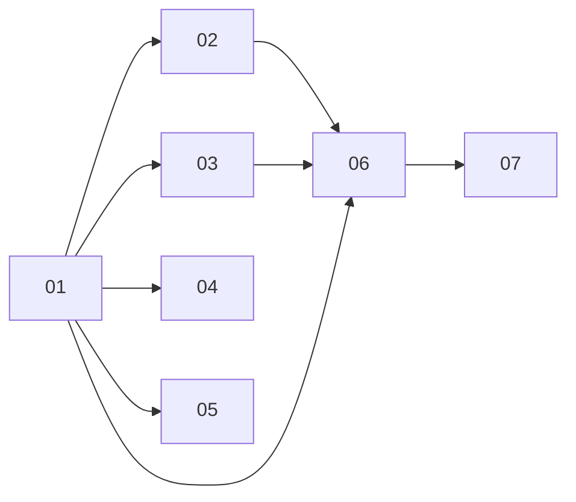

# One-time tasks — a Schedule that fires once

> Working plan — temporary, committed on the feature branch. Deleted once the feature ships.

**Issue:** https://github.com/dam-agents/dam/issues/3670

## Goal

A user or an agent can hand over a task that runs exactly once — at a chosen moment or immediately — in a fresh Session of its own, see it waiting, cancel it, and find its result afterwards. Once it has run it leaves the list of things that will still happen, stays as history for 30 days, and is pruned. Today the only way to get this is a recurring Schedule someone must remember to delete.

## Approach

A one-time task **is a Schedule**, not a new concept: a third spec type `once` beside `cron` and `rrule`. It reuses everything a Schedule already has — the Postgres row, the BullMQ arm, the reconcile, the outbox `trigger` event, the wake poke, the MCP and tRPC surfaces, the Schedules tab. Read [`docs/architecture/schedules.md`](../../architecture/schedules.md) and [`docs/architecture/runtime-delivery.md`](../../architecture/runtime-delivery.md) before any slice. The resolved vocabulary is the **Schedule** entry of [`docs/ubiquitous-language.md`](../../ubiquitous-language.md).

What differs from a recurring Schedule, and why:

| Aspect | Recurring | `once` |
|---|---|---|
| Spec | `cron` / `rrule` (+ `timezone`, `quietHours`) | `at` (ISO instant) + `timezone` (the zone the human/agent gave it in, for display) |
| Next occurrence | computed from recurrence | `at` if not yet fired, else `null` — never re-armed |
| "Now" | — | `at` omitted at create → `at = now`, fires at creation through the same rail |
| Session | `fresh` or `continuous` | always `fresh`; `continuous` rejected |
| Precheck / quiet hours | allowed | rejected (a decline would mean *never*; the moment was chosen deliberately) |
| Onboarding hold | occurrence skipped | **not applied** — the hold guards a cadence; skipping would lose the task |
| Hard stop | fire overrides it | same |
| Event TTL | min(1 h, next occurrence) | **24 h** delivery window; a queue job that runs late inside it still fires |
| `lastResult` | `success` written at commit | `delivering` at commit → `success` when the event **settles** → `missed` when it **expires undelivered**; errors as today (`failed`/error text) |
| Completion | never | **derived**, never stored: `type === "once"` and `lastRun` set and `nextRun` null |
| History | — | completed ones leave "upcoming", listed under *Past*; pruned 30 days after firing (failed included) |
| Edit | any time | only while pending (not yet fired); `at` in the past rejected |
| Cancel | delete | delete — no `cancelled` state; deleting one already `delivering` does not recall the event |
| Session type | `schedule_cron` | `schedule_once` |
| Agent creation | `create_schedule` | new MCP tool `schedule_once`, bounded by 20 open + 30 created/hour per agent (`createdBy: "agent"` only, Helm-configurable) |
| Starter kits | may declare | cannot (kit schema union has no `once` — keep it that way) |

Recurring Schedules **do not change behaviour** in this feature. The only shared-code change they see is the new per-kind settle/expire listener seam in runtime-delivery (slice 02), which they do not subscribe to.

### Pinned contract (slice 01 defines it; every other slice implements against it)

In `packages/api-server-api/src/modules/schedules/`:

```ts
// spec member added to scheduleSpecSchema's discriminatedUnion("type")
interface ScheduleSpecOnce {
  version: string;
  type: "once";
  at: string;          // ISO-8601 instant (UTC, with offset)
  timezone: string;    // IANA zone the moment was expressed in
  task?: string;
  enabled: boolean;    // always true for once; toggle is rejected
  createdBy: ScheduleCreator;
}

// tRPC inputs
scheduleCreateOnceInputSchema = { agentId, name, task, at?: string /* local wall-clock "YYYY-MM-DDTHH:mm" */, timezone: string }
scheduleUpdateOnceInputSchema = { id, name?, task?, at?: string, timezone?: string }
// procedures: schedules.createOnce, schedules.updateOnce  (list/get/delete unchanged)
```

`at` on input is a **local wall-clock time in `timezone`** (the same convention as RRULE schedules); the server resolves it to an instant, rejects a past one, and returns the resolved instant in the view (`status.nextRun`). Omitting `at` means now.

Result strings in `status.lastResult` for once: `"delivering"`, `"success"`, `"missed"`, plus the existing error text on a failed fire. The UI and CLI derive the displayed state:

- `pending` — `nextRun` set, no `lastRun`
- `delivering` — `lastResult === "delivering"`
- `completed` — `lastResult === "success"`
- `missed` — `lastResult === "missed"`
- `failed` — anything else with `lastRun` set

Watch the existing **rrule-else-cron** branches — each treats an unknown type as cron and must learn `once`: `api-server-api/src/modules/schedules/router.ts` `toView`, `mcp-endpoint.ts` `create_schedule` result, `ui/src/modules/schedules/lib/schedule-lock.ts`, `ui/src/modules/schedules/lib/schedule-format.ts`, `cli/src/modules/schedule/commands/list.ts` `cadenceOf`, `starter-kits-service.ts` `seedSchedules` (`"cron" in s`).

## Sub-issues

| #  | Title | Scope | Depends on |
|----|-------|-------|------------|
| 01 | [Once spec and fire path](./01-once-spec-and-fire-path.md) | Contract, recurrence, runner, service, tRPC, rrule-else-cron fixes in the router | — |
| 02 | [Delivery outcome and retention](./02-delivery-outcome-and-retention.md) | runtime-delivery settle/expire seam; once → `success`/`missed`; 30-day prune | 01 |
| 03 | [`schedule_once` session type](./03-schedule-once-session-type.md) | trigger payload marker, agent-runtime stamping, session-type enumerations and UI labels | 01 |
| 04 | [Agent MCP tool](./04-agent-mcp-tool.md) | `schedule_once` tool, agent limits via Helm/config, `list_schedules` branch | 01 |
| 05 | [CLI](./05-cli.md) | `dam schedule create --once --at/--now`, update, state in list/get | 01 |
| 06 | [UI](./06-ui.md) | Repeat/Once form, upcoming vs *Past*, state badges, hard-stop count | 01, 02, 03 |
| 07 | [Architecture docs](./07-architecture-docs.md) | `schedules.md`, `runtime-delivery.md`, `cli.md`, glossary check | 01–06 |



## Conventions & glossary

- **Schedule / one-time task.** Code says `once`; users read **one-time task**. Never "one-off", "one-shot" (that means platform directives with no turn) or "reminder".
- **Fire, settle, expire** — as defined in `runtime-delivery.md`: an event *settles* when the pod's handler accepts it; it *expires* when `expires_at` passes undelivered and the sweep deletes it.
- Apply **`/typescript-engineering`** for every server-side TS slice (01–05) and **`/react-ui-engineering`** for slice 06.
- Never hand-write a Drizzle migration — none is expected (spec is `jsonb`); if one turns out necessary, generate it with `mise run //packages/db:generate`.
- Always `mise run` — never `pnpm`/`go`/`helm` directly. `mise run check:comment-types` after code changes; new files must be `git add`ed before it.
- Comments: one line, only for non-derivable constraints ([comment guidelines](../../guidelines/comment-guidelines.md)).
- No new tests by default; lean on the existing suites. Keep any test that must change minimal.

## Whole-feature smoke test

On the local cluster (`cluster-ops` skill, `mise run cluster:install` / `e2e` helpers):

1. In the UI, on an agent's Schedules tab, create a **Once → Now** task "write the current date to /home/agent/work/once.txt". Within a minute it shows `delivering`, then `completed`, moves to *Past*, and links a Session of type *one-time* whose transcript did the work.
2. Create a **Once** task for 3 minutes from now; edit its task text while pending (allowed); after it fires, the edit control is gone.
3. `dam schedule create <agent> --once --at <now+2min> --task "say hi"`; `dam schedule list <agent>` shows `pending`, then `completed`.
4. Hard-stop an agent with a once task 2 minutes out; the stop dialog counts it; the fire starts the agent.
5. Scale an agent's runtime so it cannot come Ready, create a once task for now, and advance/force expiry (set the row's `expires_at` in the past, wait for the 60 s outbox sweep): the task reads `missed`.
6. In a chat, ask the agent to "check back on this in 5 minutes"; it calls `schedule_once` with an absolute `at`, echoes the resolved instant, and the task appears in the UI with creator *agent*. Ask it to create 31 in a row; the tool refuses past the hourly limit.
7. `mise run --force check` and `mise run test` are green.

## Delivery

Each sub-issue is one atomic commit. The whole feature lands as a single PR for https://github.com/dam-agents/dam/issues/3670.
