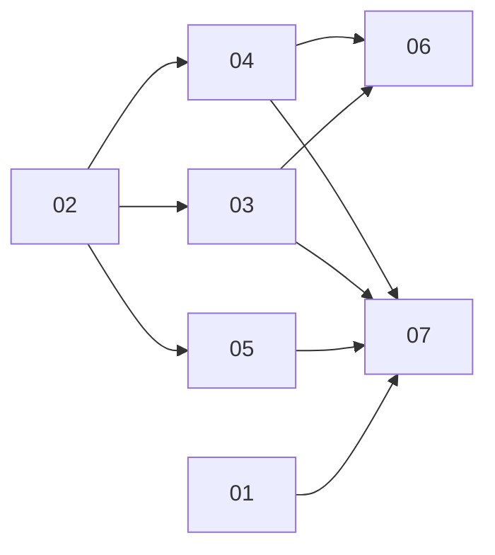

# S3-compatible object storage, signed at the gateway

> Working plan. Temporary, committed on the feature branch. Deleted once the feature ships.

**Issue:** https://github.com/dam-agents/dam/issues/4024 (design decisions: [grill log](https://github.com/dam-agents/dam/issues/4024#issuecomment-5951248165))

## Goal

A user connects an agent to an S3-compatible bucket (IBM Cloud Object Storage, AWS S3, MinIO,
Ceph) with HMAC keys, and the agent reads and writes files there with standard S3 clients. The
agent never sees the keys: it holds placeholders, and its paired gateway signs every request
with the real keys.

## Approach

S3 auth is SigV4. The secret key never travels on the wire. The client computes an HMAC over
the request with it. So unlike every Connection today, the gateway cannot *replace a header
value*: it has to **re-sign the request**. Read
[credential-gateway](../../architecture/credential-gateway.md)
(split out of security-and-credentials by slice 01) and [connections](../../architecture/connections.md)
before starting any slice.

**Connection.** One Connection = one HMAC key pair + one HTTPS endpoint (+ signing region,
+ optional bucket). New AuthConfig kind **`sigv4`** (users see "HMAC keys"). One generic
template **S3-compatible storage**, no family, no per-provider templates. HTTPS only: the
gateway forwards plain HTTP without terminating it, so it cannot sign there. IP-literal
endpoints are refused, as for Kubernetes (chains route on SNI).

**Contribution.** New kind **`egress-sign`** `{host, port?, pathPattern?, region, service}`.
Same rail as `egress-inject`: an `egress_rules` allow row per grant plus a gateway-side
credential. When a bucket is set, rules are path-scoped to `/<bucket>` and `/<bucket>/*`.
Otherwise the whole host is allowed. The key's upstream role is the real permission limit.

**Secret.** The per-Connection Secret holds the two keys as an AWS credentials file (one
`[default]` profile) under its own data key, and the `injection-hosts` descriptor gains a
signing entry (host, port, region, service, the credentials-file key). Annotations are fixed
at create, so the descriptor must be complete then.

**Gateway.** On the host's L7 chain, after the injectors and before the dynamic forward proxy
and router:

1. a Lua **guard** that refuses `x-amz-content-sha256: STREAMING-*` with a readable 400
   naming the fix (`request_checksum_calculation = when_required`);
2. Envoy's **`aws_request_signing`** filter: `service_name: s3`, the Connection's region,
   `use_unsigned_payload: true`, credentials from the mounted credentials file with
   `watched_directory` (rotation without a pod roll), and **no fallback** to env or instance
   metadata. Envoy overwrites `x-amz-content-sha256`, which is why clients are pinned to plain
   bodies.

Both steps are **always** gated with `skippedUnlessAddressed`, whatever the Agent's
`requireConnectionAddress` says: they run only when the request names this Connection. All
other requests on the host pass unchanged, including the platform's own presigned artifact
links, which can share an endpoint with a user's bucket.

Ordering trap: the router applies `host_rewrite_literal`, the route `prefix_rewrite` and
removal of `x-platform-conn` **after** the http filters. The signer must therefore set its own
`host_rewrite` to the upstream host (and `:port` when not 443) and leave `x-platform-conn` out
of the signed headers (`match_excluded_headers`). Path-prefix addressing
(`/__platform_conn/<id>/`) is not supported for `sigv4` Connections, because the prefix would
be stripped after signing.

**Addressing.** The agent's access key ID is the Connection placeholder `platform:conn:<id>`,
and the secret key is a dummy. The address Lua step learns to read the id from
`Authorization: AWS4-HMAC-SHA256 Credential=<id-placeholder>/<date>/...`. Two S3 Connections on
one endpoint are then both addressed and grantable together.

**Agent side.** Always AWS profiles, one per Connection, named after the Connection:
`~/.aws/credentials` (placeholder key pair) and `~/.aws/config` (`endpoint_url`, `region`,
path-style addressing, `request_checksum_calculation = when_required`,
`response_checksum_validation = when_required`). `AWS_PROFILE` = the preferred grant, else the
earliest grant, mirroring gh's multi-account handling. No `AWS_*` key env. No S3 client is
baked into images: the `platform-s3` skill tells the agent to install one on demand
(`uv tool install awscli` gives aws-cli v1, `uv pip install boto3`).

**Known limits (documented, not built):** presigned URLs made by the agent, signed `aws-chunked`
uploads, rclone and minio-go config, private-network endpoints the cluster cannot reach.

## Sub-issues

| #  | Title | Scope | Depends on |
|----|-------|-------|------------|
| 01 ✅ | [Split the credential gateway page](./01-split-gateway-page.md) | Docs only: move the gateway mechanics to their own page so the security page is under its cap | — |
| 02 ✅ | [`sigv4` Connection: contract, template, create](./02-sigv4-connection.md) | Auth kind, `egress-sign` kind, template, Secret, egress rules, create-time validation, all exhaustive switches | — |
| 03 ✅ | [Gateway signing step](./03-gateway-signing.md) | Controller: signing filter, STREAMING guard, `Credential=` address parsing, always gated; early IBM check | 02 |
| 04 ✅ | [AWS profiles on the agent](./04-aws-profiles.md) | Addressing for `egress-sign`, profiles + `AWS_PROFILE`, ini parser fix, `platform-s3` skill | 02 |
| 05 ✅ | [Rotate the key pair](./05-rotate-key-pair.md) | Update contract with both keys, service, dialog, CLI | 02 |
| 06 ✅ | [e2e: signing and passthrough](./06-e2e-signing.md) | Smoke spec against httpbingo | 03, 04 |
| 07 ✅ | [Architecture docs](./07-architecture-docs.md) | connections page, gateway page, glossary | 01, 03, 04, 05 |

Build 03 right after 02. It is where we learn whether IBM COS accepts `UNSIGNED-PAYLOAD`
through Envoy. If it refuses, stop and go back to the design (grill decision 2).

## Conventions & glossary

- **`sigv4`**: the AuthConfig kind. User-facing label: "HMAC keys". Template name:
  "S3-compatible storage".
- **`egress-sign`**: the Contribution kind for a host whose requests the gateway re-signs.
- **Signing step**: the gateway's `aws_request_signing` filter for one Connection on one
  chain. Not "injector".
- **Token placeholder** / **address**: as defined in
  [connections](../../architecture/connections.md#addressing-a-connection). For `sigv4` the
  placeholder is the access key ID.
- Apply **/typescript-engineering** to all server-side TS (api-server, api-server-api,
  agent-runtime) and **/react-ui-engineering** to `packages/ui`.
- Follow [comment guidelines](../../guidelines/comment-guidelines.md) and run
  `mise run check:comment-types` after code changes.
- Never hardcode the brand. Use `mise run` for every build, check and test.
- No new tests unless a slice says so. Grill decision 9 asks for controller unit tests (03) and
  one e2e spec (06). Those are the only exceptions.

## Whole-feature smoke test

On the local cluster (`mise run cluster:install`, see the `cluster-ops` skill), with a real IBM
COS bucket and HMAC keys the **user** enters in the UI (the keys never pass through the agent
writing code):

1. Create an "S3-compatible storage" Connection (endpoint
   `https://s3.<region>.cloud-object-storage.appdomain.cloud`, region `us-standard` or any
   string, bucket set). Wrong keys are refused at create.
2. Grant it to an agent. In the agent: `cat ~/.aws/credentials` shows only
   `platform:conn:<id>` and a dummy secret; `echo $AWS_PROFILE` names the Connection.
3. Agent runs `uv tool install awscli`, then `aws s3 cp`, `aws s3 ls s3://<bucket>`, a
   multipart upload of a ~100 MB file, `aws s3 rm`. All succeed.
4. With `request_checksum_calculation` removed from the profile, an upload fails with the
   gateway's readable message, not a signature mismatch.
5. Publish an artifact from the same agent. It still works (presigned links pass unchanged).
6. Rotate the keys in the UI. The next request uses the new keys, no pod roll.
7. A second S3 Connection on the same endpoint can be granted alongside the first.
   `--profile <other>` acts as the other account.

## Delivery

Each sub-issue is one atomic commit. The whole feature lands as a single PR for #4024. After it
merges, file the follow-up "ask before writes" defaults issue (grill decision 6).
