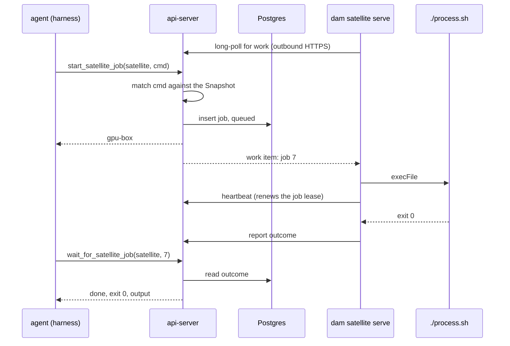

# Satellites

A **Satellite** is a command surface running on the user's own machine, reached by an outbound connection the machine initiates, that lets an Agent trigger a finite, pre-declared set of commands on a host the Agent has no other access to.

**Status: grilled and built.** Contract grammar, api-server module, MCP tools, CLI worker, wake on finish, the UI section and an e2e spec all exist and are tested.

## Problem

A user has a capable machine in a higher-security zone — GPUs, a large dataset, a licensed toolchain, a pipeline that only runs there. They want an Agent to *run the workloads on it*, and emphatically do not want the Agent to have access to it. The zone's firewall also rules out the obvious shape: nothing in the cluster may dial in.

What the user actually has is a handful of specific commands, each parametrized in a handful of specific ways. That is the thing to expose — not a shell, not a filesystem, not a network route.

## Shape

`dam satellite serve` runs on the machine that runs the commands. It **polls** the api-server for work over ordinary outbound HTTPS, executes what it is given, and posts the outcome back. The api-server holds the queue; the Agent reaches its Satellites through tools on the platform MCP server it already has.



Nothing is pushed and no socket is held. Three properties follow, and each replaced a worse alternative:

- **No replica pinning.** [platform-topology](../architecture/platform-topology.md) is explicit that affinity was tried for the harness path and abandoned — `sessionAffinity` is bypassed on a waypoint-fronted Service, and consistent-hash on source IP degrades to per-request random behind the waypoint. A held WebSocket would land a Satellite on one replica while the Agent's tool call lands on a random one, forcing Redis request/response routing for every call. A queue in the shared store needs none: **any replica serves any request from either side.**
- **Outcomes outlive both ends.** A job survives the `serve` process dying, the Satellite going offline, and the Agent hibernating for hours. Under a held socket, `get` and `wait` would be round-trips to a machine that may not be there.
- **It traverses corporate proxies.** The egress proxies fronting the zones this feature targets routinely mangle or forbid WebSocket upgrades. Plain HTTPS long-poll gets through, with the same outbound-only direction.

Because the api-server is the MCP server, **MCP is not the protocol between Platform and a Satellite**. The Satellite speaks a small private RPC — claim work, heartbeat, report outcome — so the CLI carries no MCP SDK, no transport lifecycle, and no protocol version to keep in step. The corollary is deliberate: a Satellite is unreachable except through Platform, which is the point.

## Manifest

One file beside the commands, naming the Satellite and the commands it permits.

```toml
name = "gpu-box"
description = "Pipeline box in the ops zone"   # the model reads this
cwd = "/srv/pipelines"
timeout = "6h"
max_concurrent = 16                            # jobs at once; per-command override below

[[command]]
run = "./process.sh (sales.db|events.db) [-n ^[1-9][0-9]{0,3}$]"
about = "Process a database"

[[command]]
run = "./train.sh ./data/**/*.db [^--epochs=[1-9][0-9]{0,2}$]"
about = "Train against a dataset"
timeout = "12h"
max_concurrent = 1                             # GPU-exclusive

[[command]]
run = "git -C /srv/repo (pull|status)"
approval = "always"
```

`run` is a **Command Pattern, not a shell line**. It is tokenized on whitespace and executed with `execFile`. No quoting, no globbing, no `$VAR`, no pipes, no shell, ever — the format resembles a shell line and users will assume otherwise, so the docs must say this loudly.

### Grammar

| Form | Meaning |
|---|---|
| `literal` | matches exactly, nothing else |
| `(a\|b\|c)` | one of a closed set |
| `[…]` | optional |
| `(…)...` | repeats, capped |
| `*` | one filename-like argument, or part of one — no `/` |
| `**` | one path-like argument, or part of one — `/` allowed |
| `^…$` | a regex covering a **whole** argument |

Seven forms, no sub-syntax. There are no named placeholders: the names were never
read by anything — not the matcher, not the model — and explaining what to pass is
the `about` line's job, not the pattern's.

A star may sit anywhere in a token, so `--limit=*` and `./data/**/*.db` both parse.
A regex may not: it covers the whole argument or nothing. That reads like a
restriction and is not one — the argument *is* the whole thing, so
`^--limit=[1-9][0-9]?$` constrains a flag's value exactly, prefix included. It is
also the escape hatch for a literal `*`, `(`, `|` or `[`, which are structural
everywhere else: write the argument as a regex and escape it there.

`**/` spans zero or more whole segments, so `./data/**/*.db` still matches
`./data/a.db`. Integer ranges are gone; `^[1-9][0-9]{0,3}$` covers the cases that
had them, at the cost of admitting a leading zero where a range would not.

**`**` is the widest thing the grammar can say, and the easiest to reach for.**
`./run.sh **` accepts `/etc/passwd`. `*` is the default reach; `**` is a deliberate
widening, and nothing in the grammar can stop an author choosing it.

### Argument rules

- **Leading dash.** A matched argument may not begin with `-` where the caller chose its first character, unless it sits after a literal `--`. Both exceptions are cases where the author already pinned that character: `--limit=*` spells the dash itself, and a whole-argument regex has named every character the argument may hold. This protects only as far as the target script honors `--`, which the platform cannot verify and the docs must state rather than imply.
- **Traversal.** A matched argument containing a `..` segment is rejected, with no normalization, whatever matched it. Otherwise `./data/**/*.db` accepts `./data/../../etc/shadow.db` — a traversal escape straight out of the allowlist. This rule has no exception: a regex can widen what an argument may say, never where it may point.
- **Size.** Per-argument length and argv count are capped. A user-authored regex meeting model-supplied input is a ReDoS on exactly the machine this feature exists to protect; a length cap closes it for what it costs.

## Tool surface

Satellites are tools on the **platform MCP server** the Agent already has, not a separate MCP entry. The endpoint is stateless — it builds a server per request ([`mcp-endpoint.ts`](../../packages/api-server/src/apps/harness-api-server/mcp-endpoint.ts)) — so registering them only when the Agent holds at least one Satellite Grant costs nothing and needs no invalidation, exactly as `kbShares: null` already gates the knowledge-base tools.

| Tool | |
|---|---|
| `start_satellite_job(satellite, cmd)` | returns `gpu-box#7`, running |
| `wait_for_satellite_job(satellite, job)` | blocks until the job ends, or returns `running` |
| `get_satellite_job(satellite, job)` | `running` / `done` / `interrupted` / `none` |
| `cancel_satellite_job(satellite, job)` | requests cancellation |

`cmd` is a `string[]` mapping 1:1 to what gets executed — `["./process.sh", "sales.db", "-n", "50"]`. **No named-tool facade over the commands:** users think in terms of the script they run, and a facade would put a second vocabulary between them and it while helping nothing.

`cmd`'s schema is plainly `string[]`; the **Command Patterns go in the tool description**, grouped under each granted Satellite's name, in the same usage syntax the Manifest is written in. Compiling them into a JSON Schema `anyOf` was rejected: models read a large union poorly, most harnesses don't enforce `inputSchema` anyway, and enforcement is authoritative server-side regardless. A rejection therefore has to teach — it names the pattern it came closest to and where the match broke.

`wait` takes **no timeout parameter** — the model has no basis for choosing a number. It blocks until a server-side deadline set under the shortest infrastructural limit on the harness route, then returns `running`. Relying instead on the harness's own tool-call timeout would surface as a *tool error*, which is ambiguous: the model could not distinguish "still running" from "the Satellite died". A clean `running` says one thing. The description carries the contract: *blocks until the job finishes; may return `running`, in which case call `wait` again*.

## Job lifecycle

Every call is asynchronous, because the workloads that motivate the feature run for hours.

A Job is identified by `(satellite, sequence)` — a per-Satellite integer, rendered `gpu-box#7` in tool results, logs, audit rows and the UI. The composite key says the Satellite owns its own numbering, and a small integer reads better than a UUID everywhere a human meets it. **The sequence is minted server-side at `start`**, since the Satellite has not seen the job yet when the id must be returned.

| State | Meaning |
|---|---|
| queued | accepted and matched; no worker has claimed it |
| running | claimed by a worker, which is renewing its lease |
| done | terminal: exit code and captured output |
| interrupted | the worker stopped renewing — outcome unknowable |
| cancelled | terminal after a cancellation the worker acknowledged |

**Interruption is detected by lease expiry, not by a report.** A claimed job carries a lease the worker renews on each heartbeat; when renewal stops, a sweep marks the job interrupted. This is the only mechanism that works when the machine is the thing that died — a `serve` process that dies cannot file a report about itself.

**Cancellation is cooperative and travels on the poll.** The work the Satellite claims is not only new jobs: a cancellation for a job it is running is delivered on the same channel, and the worker signals the process group and reports the outcome. A cancellation for a job still queued settles server-side with no worker involved.

**Jobs are never retried.** These commands are not idempotent, and neither Platform nor the Satellite has any basis for deciding one is safe to run twice.

### Output

Output is always captured, stdout and stderr **merged** in the order a terminal would show them, and returned with the exit code. There is no capture mode to configure and no truncation: **under 4 KB the text comes back inline; over it, the tool returns a path instead**, and the full log is materialized as a file in the Agent's own sandbox. The Agent then reads it with `grep`, `sed`, `tail` and no restrictions at all, so a 400 MB log costs the model four lines rather than a context window — and every head-and-tail elision scheme becomes unnecessary.

The file is written **at read time, not when the outcome arrives**. A worker reporting an outcome may find the Agent hibernating, over budget or deleted, with no pod to write into; an Agent calling `get` or `wait` is definitionally up. So the outcome lands in Platform's store and materializes on first read, written once and reused for later reads since the Job id is stable. The log directory needs a retention sweep, or an Agent running thousands of Jobs slowly fills its volume with logs nothing will read again.

Platform storing outcomes at all is a change from the first draft and worth stating plainly: it exposes nothing new, since the output is going to an Agent inside the cluster regardless, and it is what makes the audit trail complete without trusting a Satellite to report on itself. Outcomes expire on a TTL rather than accumulating forever.

## Bounds

Every control so far constrains *what* a command may be; none constrains *how many*. A prompt-injected Agent cannot run `rm -rf`, but it can queue ten thousand copies of a six-hour training run — denying the very machine the feature exists to make available, and growing the queue table without limit.

The bound is a **depth cap, not a rate limit**, following the only two bounds the api-server already has (max API keys per owner, max shared knowledge bases per account — standing counts checked before create). Depth is self-relieving as Jobs finish, it measures the actual scarce resource (one worker's serial attention, which a single long Job saturates as thoroughly as a thousand short ones), and it rejects in terms a model can act on: *gpu-box has 64 jobs active (the limit) — wait for one to finish*.

Two different numbers do this, and conflating them is what made the first draft wrong.

**`max_concurrent` — how many Jobs run at once. Default 16, per-command override.** Parallelism is the default because `start` returning `running` has to be true: with serial execution the second call returns a Job that silently sits behind the first, possibly for hours, and the model cannot tell the difference. An Agent that wants serialization already has the means to say so — it calls `wait` — so implicit queueing removes a decision the caller can already express. The per-command override exists for the genuinely exclusive command (`train.sh` holding a GPU, a script assuming a lockfile) and the worker respects the tighter of the two. This is purely the Satellite's business: it bounds that machine's capacity, Platform stores nothing extra for it, and the server need not know it.

**There is no backlog.** Non-terminal Jobs may never exceed `max_concurrent`: a Job is admitted only when a worker will pick it up within a poll interval, and `start` is otherwise refused outright — *gpu-box is running 16 jobs (max 16) — wait for one to finish*. That is what makes the `running` it returns honest in every case rather than the common one, and it reduces `queued` to a transient state between insert and claim.

So `max_concurrent` is the whole bound, which is why **Platform clamps the declared value to an operator ceiling**. With no backlog behind it, that one number now governs Platform's storage as well as the machine's capacity, and a Manifest declaring a million would reopen exactly the flood this section exists to close. Everywhere else the Manifest governs the user's own machine and wins; here the resource is partly Platform's, so the Satellite may ask for less than the ceiling and never for more.

**Pending-approval Jobs count toward the limit**, though they consume nothing on the machine — otherwise an Agent creates unbounded Jobs that are all waiting on a human.

Hitting the limit never cancels anything: running Jobs finish and new starts are refused until one clears.

## Authority changes mid-flight

Revoking a Satellite Grant, deleting a Satellite, and deleting an Agent share a shape: the command is already executing on the user's machine, where Platform has no reach. One rule covers all three — **revocation stops dispatch and stops reads, never execution.**

Queued Jobs are cancelled server-side, since nothing ran and nothing is lost. Running Jobs finish. After a revoked grant or a deleted Agent their outcomes are still recorded and only the Agent's access is gone; after a *removed Satellite* the Job rows go with the Satellite, so the command runs on with nothing listening and no record kept. Stopping the command itself is the job of whoever is at the machine.

Blocking deletion while Jobs run was rejected: it makes "stop this" fail exactly when a user most wants it, and anyone who can start a Satellite can kill its processes directly.

## Wake on finish

A Job outliving the turn that started it is the normal case, so a terminal outcome **wakes the Agent**. Without it the obvious use — kick off the nightly pipeline, then summarize what it produced — fails silently at the last step: the outcome would sit in the store until somebody next prompted the Agent and it thought to ask.

The wake delivers a synthetic prompt carrying **the same payload `wait_for_satellite_job` would have returned** — same shape, same inline-or-path rule — so the Agent meets the result in a form it already knows rather than a bespoke notification. It cannot literally be a tool result: the session that started the Job may be long gone, and the woken turn is a new one. The pod is up by definition at wake time, so materializing a large Job Log there is consistent with writing it at read time.

There is no opt-out flag. Two rules keep that from becoming noise, and they are load-bearing rather than refinements:

An Agent parked over budget cannot wake, so its wake **requeues hourly** until the outcome's TTL lapses. The outcome is durable regardless; what the retry protects is the summarizing half of the job actually happening once the budget frees.

- **An outcome already delivered does not wake.** An Agent sitting in `wait` gets the result there; waking as well would produce a second turn about a Job it just handled. Whichever path reports an outcome first marks it delivered.
- **Simultaneous finishes coalesce.** Three Jobs ending within seconds wake the Agent once with three results.

Holding the pod awake for the Job's duration was rejected as the single most expensive thing available here — six hours of compute against the owner's budget to avoid one wake — and it buys nothing the wake does not.

Schedules already wake an Agent with a synthetic prompt; this adds *wake with a payload*. If a second subsystem wants that, it is a shared rail rather than a satellite feature.

## Satellite lifecycle

The Satellite record is durable; a worker is not.

- **Identity is `(owner, name)`.** Per-owner by design: two people wanting the same machine run one Satellite each, so every call stays attributable to a real person's key. Platform's sharing model lends *Agents*, never resources ([multi-player](../strategy/multi-player.md)), and a shared Satellite would be a second sharing primitive. Duplicate `serve` processes on one machine under different owners are the accepted cost.
- **Authentication** uses the existing bearer or API key ([cli](../architecture/cli.md#authentication)) under a new `satellites:serve` scope, so a leaked Satellite key can serve a Satellite and cannot operate Agents.
- **The Manifest is pushed on connect** and kept server-side as the Snapshot, which is what the tool descriptions are built from. It therefore survives the Satellite being offline: an Agent can always see what a Satellite *would* accept.
- **Online is a heartbeat with a TTL**, shared like every other cross-replica fact. No socket presence to interrogate, no per-replica view to reconcile.
- **One worker per Satellite in v1, running Jobs in parallel.** Several *workers* claiming one queue would need a claim protocol and stays a non-goal; concurrency *within* a worker needs none — it claims up to `max_concurrent` Work Items and spawns that many children. `serve` takes an exclusive lock on its local state directory, so two processes cannot share one machine's bookkeeping.

The Snapshot is a **claim by the Satellite, not a platform guarantee**: identity is the name, so a Satellite reconnecting from a different checkout can serve the same name backed by different scripts. The user owns both ends, so this is acceptable — but the UI should say it rather than present the Snapshot as verified, and a Satellite reappearing from a different host should say so loudly.

### Discovery lag

A running harness lists tools once at spawn. Granting a Satellite, or adding a command, is therefore invisible until the harness restarts — matching every other MCP entry on the platform, since an `mcp-entry` change does not recycle the harness either ([`harness-lease.ts`](../../packages/agent-runtime/src/modules/acp/services/acp-runtime/harness-lease.ts) recycles only for config and env).

Enforcement never lags, only discovery: `start` matches against the live Snapshot, so an edited command works immediately and a removed one is refused immediately, even while the description the model read still advertises it. The CLI prints this after pushing a changed Manifest and the UI says it on the grant toggle. Inventing a recycle trigger was rejected for v1 — there is no contribution on the runtime channel to hang one off, so it would mean a new event kind purely for tool-list freshness.

## Running the worker

**Shutdown drains.** The first interrupt stops claiming Work Items and waits for running Jobs; a second forces the exit. The familiar idiom, and it matters more here than usual because a Job can run for hours: a user restarting to pick up an edited Manifest simply waits, and a machine shutting down gives `serve` its grace period.

While draining, the Satellite reports itself as such, so `start` is refused with a reason rather than timing out. On the forced second signal the worker **reports its Jobs interrupted before exiting** — it is still alive at that moment, so it can say so directly. That leaves two honest paths to `interrupted`: *reported*, when the worker knows it is dying, and *detected* by Lease expiry, when it never got the chance.

**Reload is SIGHUP**, and the Snapshot is re-pushed on reconnect. Restart-to-reload would have coupled a one-line Manifest edit to the longest running Job, which the drain makes unacceptable. Watching the file was rejected as convenient while authoring and surprising in production, where a half-saved file would be picked up mid-edit.

Running Jobs keep executing under the Command Pattern they matched at start: re-validating them against a new Manifest would be retroactive policy, and the process is running regardless. **A reload is refused for two reasons, and both keep the running Manifest** — it does not parse, which would otherwise drop the machine to an empty command set on a typo; or it renames the Satellite, which is a different machine under `(owner, name)` and needs a restart. An accepted reload reaches the Snapshot before the worker, so the machine never enforces a Manifest the server has not taken. A reload that *removes* a pattern takes effect at once for new starts while the Agent's tool description still advertises it, which is the discovery lag arriving by a new door.

## Attachment to Agents

A first-class `satellites` module owns the Satellite records and the Satellite Grants. Grants are per-Agent and owner-scoped; no cross-user sharing in v1.

Connections were considered as the vehicle (the shared-knowledge-base precedent) and rejected: a Connection exists to carry credentials and contributions, and a Satellite carries **no secret** — the Agent authenticates as itself on the harness route and the server resolves grants per request. Routing it through Connections would mean a 1:1 shadow record with divergent lifecycles and a second hidden managed template in a catalog that already has one. With tools on the platform MCP server there is no contribution to deliver at all, so a grant is a pure server-side read on a path that is already per-request.

## Surfaces

Deliberately minimal for v1.

**UI** — a Satellites section **inside the Connections tab**, not a destination of its own and not rows in the Connections list. Adjacent because "a thing my agent can reach, granted per Agent" is the same shelf to a user; separate because a Satellite is not a Connection in the model, and one merged list would re-assert exactly the identity that was rejected. The section shows each Satellite's online state and last-seen, the host it last connected from, its Command Patterns, its active Jobs, and per-Agent grant toggles. Grants are also togglable from an Agent's own settings, where the question "what can this agent reach" actually gets asked.

**CLI** — `dam satellite serve` plus **bare parity**: one thin verb for each action the UI offers (`list`, `grant`, `revoke`, `jobs`, `cancel`, `rm`) and nothing beyond them. The parity rule in [cli](../architecture/cli.md) holds rather than taking its first exception, and each verb is a wrapper over a procedure the UI already calls.

`serve` is the one verb with no UI counterpart, and its **log is the interface**. The parsed Command Patterns print at startup and on every reload, so "did my pattern parse the way I meant" is answered without a `check` verb. Every refused command is logged with the pattern it came closest to and where the match broke. Every Job start, exit and duration is one line. It takes an **explicit Manifest path** — no well-known filename, no discovery: the file decides what may run on this machine, and finding it implicitly is the wrong kind of convenience. Registration is implicit on first connect, so there is no `register`.

The UI ships behind a per-user experimental feature flag ([features](../architecture/features.md)), as Knowledge Bases did, so the grammar meets real Manifests before everyone sees it. The flag is disclosure rather than authorization, so it gates the section and not the CLI or the agent's tools — and the agent surface needs no gate of its own, since the tools appear only for an Agent holding a grant.

## Security posture

**Matching is authoritative server-side, execution is constrained satellite-side.** The api-server matches `cmd` against the Snapshot before a job is ever queued; the worker re-validates against its own Manifest before spawning, because the machine does not delegate to the cluster the question of what may run on it. Execution takes the pattern's own literals, the Manifest's working directory, and no caller-supplied value beyond a validated argument — never a shell. The command inherits the worker's own environment; the Manifest declares none.

Anything an Agent can call is callable by a **prompt-injected** Agent. That is the whole exposure surface, and it is why the grammar cannot express an unbounded argument. Two further controls:

- **Per-command approval.** `approval = "always"` on a Command Pattern gates the *start* — never `wait`, `get`, or `cancel` — through the human-in-the-loop queue ([security-and-credentials](../architecture/security-and-credentials.md)), default off. It **reuses `pending_approvals`** as a third type beside ext_authz and acp_native: the user-facing concept really is "something wants your permission", Home already aggregates exactly that, and a parallel queue would be a second place to look. It differs from both existing types in two ways that make it cheaper rather than dearer.
**Approval is a Job state, not a held call.** ext_authz blocks the request for up to `approvalHoldSeconds` waiting on a verdict; a gated start holds nothing. The Job is created *pending approval* and the id returns immediately, so no turn ever stalls, `wait` reports the pending state the way it reports `running`, and the orphan window stops applying. An unattended Agent hitting a gated command therefore does not fail — its Job waits for a human and runs when approved, which is what a nightly pipeline gated on a person should do. The verdict moves the Job to queued or cancelled.

**Only the once verdicts are offered.** The Verdict vocabulary's permanent pair exists to write an egress rule, and the satellite equivalent would be a per-`(agent, satellite, pattern)` rule store splitting policy between the Manifest and the platform. Instead, **removing `approval = "always"` from a Command Pattern is how a user says "allow forever"** — authored in the same file as the allowlist, on their own machine, beyond the cluster's reach. One source of truth for satellite policy. The approvals UI needs per-type button capability rather than always rendering allow-forever, which it arguably owes anyway.

A pending Job surfaces **both** in the session (a synthetic permission frame, as ext_authz injects, under its own session-id marker rather than the egress one) and on Home with every other pending approval, so it is answerable wherever the user happens to be.

- **Audit.** Every start, verdict and outcome lands in the real-identity audit trail ([logging](../architecture/logging.md)) with the literal argv and the Command Pattern it matched. Because outcomes are stored server-side, the trail does not depend on a Satellite reporting honestly about itself.

## Non-goals for v1

Output streaming and progress notifications; file transfer in either direction; interactive stdin; several workers per Satellite; cross-user sharing; unbounded outcome retention.

## Review fixes

The first guardian pass found three promises with one hole each, and they are worth keeping as invariants rather than one-off fixes:

- **A machine that is shutting down refuses new work.** `touch` writes only last-seen; the draining flag moves on connect and drain alone, so a heartbeat cannot un-shut a machine.
- **A Job that is accepted really starts.** The live count and the insert share one transaction, so two starts arriving together cannot both read a count under the limit and both land.
- **The owner hears every result.** Delivery follows *every* terminal settle — the worker's report, the lease sweep, a declined approval, a cancellation, a removal — and a claim whose wake cannot be written is released rather than lost.

Alongside them: a regex token is compiled as `^(?:…)$`, because a top-level alternation otherwise escapes its own anchors (`^a$|^b$` matched `xb`); a cancelled or timed-out Job reports as cancelled or interrupted rather than as one that finished with exit 1; and the worker signals the process *group*, so a script's children die with it.

## Footprint

New architecture page `docs/architecture/satellites.md`, plus edits to [cli](../architecture/cli.md) (the `satellite serve` verb and the parity exception), [security-and-credentials](../architecture/security-and-credentials.md) (the new scope and the approval gate kind), and [platform-topology](../architecture/platform-topology.md) (a second polled outbound surface).

Code lands as a `satellites` module in `packages/api-server` and `packages/api-server-api`, a `satellite` group in `packages/cli`, the worker-facing routes beside the existing harness endpoints, and satellite tool registration in the platform MCP session. The Command Pattern parser and matcher belong in the contract package: the server matches with them and the CLI validates and lints with them, so the two can never drift.

## Testing

The security-critical half needs no cluster. The CLI already has the right shape — `packages/cli/src/__tests__/*.integration.test.ts` build the real bundle and `execFile` `dist/bin.js` against a stub HTTP server, asserting exit codes and output — and pattern matching, refusal, argv construction, concurrency limits and drain all test that way: stub the platform side, hand the worker a Work Item, assert what ran and what was reported. Everything that decides whether a command is permitted is covered before a cluster is involved.

The end-to-end path (grant, tool call, Job, wake) is one Playwright smoke test, which would be **the first spec in that suite to spawn the CLI** — nothing under `playwright/src` invokes `dam` today. That is the new shape to budget for, not the matcher tests.

## What the build settled

- **Wake on finish rides its own event kind.** `satellite-outcome` is a runtime event with a synthetic prompt carrying what `wait` would have returned, handled by an agent-runtime plugin that opens an ordinary chat session — a session type of its own would have needed a UI category nobody asked for, and the turn belongs where a user looks for what their agent did. Reusing the schedules `trigger` kind was rejected: the event report routes by kind into schedules, which would fail to find a schedule row. Older runtimes are safe because the delivery worker already drops event kinds an agent does not advertise.
- **Coalescing is a single atomic claim, not a debounce.** Delivery claims *every* undelivered terminal outcome for the Agent in one statement and renders them into one turn, so whichever delivery runs first takes them all and a second finds nothing. That is cross-replica safe without a timer.
- **The over-budget retry is hourly and stateless.** A wake that cannot fire leaves the event pending; an hourly sweep re-attempts the wake for any Agent still holding an undelivered outcome.
- **Interruption detection is a per-minute lease sweep**, alongside the outcome retention purge.

## Open questions

1. **`wait`'s deadline.** The api-server already holds requests far longer than needed — ext_authz Held Calls default to 30 minutes — and no `VirtualService` in the chart sets a route timeout, which Istio leaves unset by default. The waypoint therefore probably imposes no ceiling, but confirm with one long request before picking a number: an operator can add a mesh-wide default.
