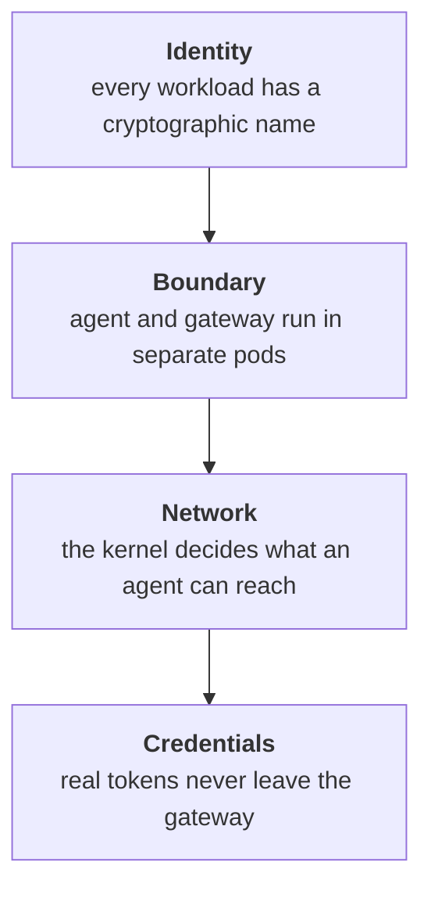
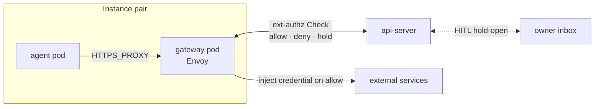

# Security overview

How Platform isolates agents from each other, from the cluster, and
from the credentials they use to reach external services.

## Layers of defence

Each layer does one job; you'd have to break all four to compromise
an instance.

**Identity.** Every workload runs as a per-instance ServiceAccount,
and istiod stamps that SA into a SPIFFE workload certificate. Mesh
admission decisions are made on the certificate, not on IP or port —
a peer instance can resolve the gateway's address but its call is
denied before it lands.

**Boundary.** Agent and gateway run as two separate pods, not as
sidecars in one pod. The credential boundary is a pod boundary, with
its own kernel view and no shared address space. The agent has no
service-account token mounted and no co-located sidecar to share a
namespace with.

**Network.** Even if the agent process ignored `HTTPS_PROXY` and tried
to dial external hosts directly, the kernel refuses. A per-pair
agent-egress NetworkPolicy restricts L3/L4 egress to DNS, the paired
gateway, and the mesh — so Envoy stays on the only path out.

**Credentials.** Real upstream tokens never leave the gateway pod.
Envoy reads them via SDS and adds the credential header on the wire,
just before the request exits. The agent process never sees a real
token to leak in the first place.

## Trust boundary

Every internal hop carries a SPIFFE identity stamped by istiod, and
every admission is gated on it.

Three AuthorizationPolicies per instance form the cryptographic
boundary: gateway admission, the harness path on the api-server, and
the per-instance ext-authz Service. Each is keyed on the per-instance
ServiceAccount, so peer instances are denied at the mesh — they can
resolve the address but the call never lands.

On top of that boundary, every credentialed request runs through a
second gate. An Envoy filter on the gateway makes a gRPC ext-authz
Check to the api-server before injecting a credential, with the
calling instance proven cryptographically by the ServiceAccount on
the connection. The api-server matches the request against the
instance's egress rules and answers allow, deny, or hold-open. A
held-open Check waits while the owner approves or denies the egress
from the inbox in the UI; if the verdict is deny — or none arrives —
the Check fails closed and the agent gets a 403 with no credential
ever injected.

## Threats and mitigations

| Threat | Mitigation |
|---|---|
| Agent steals an upstream token | Credentials live only in the gateway pod; Envoy injects them on the wire and the agent sees no real token |
| Agent escalates via its ServiceAccount token | `automountServiceAccountToken: false` on both pods — istiod issues the workload cert without a mounted SA-token |
| Agent reaches a peer instance's gateway | Per-instance AuthorizationPolicy denies traffic from any non-matching ServiceAccount |
| Agent bypasses the proxy to call external hosts directly | Per-pair agent-egress NetworkPolicy restricts L3/L4 egress to DNS, the paired gateway, and the ambient mesh |
| Route-confusion exfil through the gateway | Per-host Envoy filter chains pinned to each credential's host, with SAN-bound upstream TLS validation |
| Direct pod-IP bypass of the api-server | Pod-level DENY AuthorizationPolicy admits only the waypoint's SA (harness) or a per-instance SA (ext-authz) |

## See also

- [security-and-credentials](../architecture/security-and-credentials.md) — current-state architecture details
- [security-model](security-model.md) — narrative framing of the three risks: execution, credentials, confidentiality
