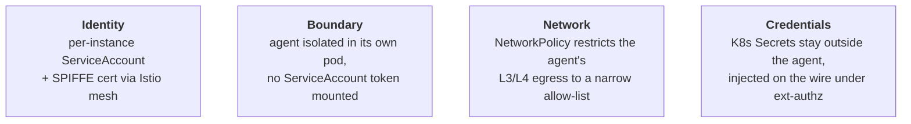
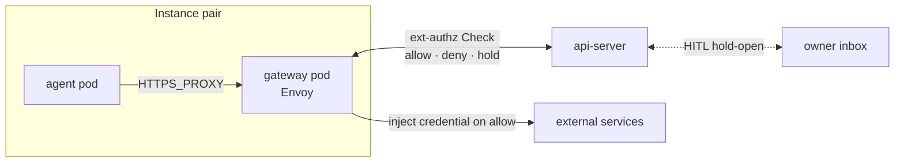

# Security overview

How Platform isolates agents from each other, from the cluster, and
from the credentials they use to reach external services.

## Layers of defence

Four controls, layered for defence in depth. They overlap and
reinforce each other rather than working in isolation — identity
underpins authorization, the pod boundary contains a credential leak,
kernel-level network policy forces traffic through the proxy
regardless of process intent, and credential isolation means there's
nothing real for the agent to expose in the first place.

**Identity.** Every workload runs as a per-instance Kubernetes
ServiceAccount, and istiod stamps that SA into a SPIFFE workload
certificate as the pod joins the Istio ambient mesh. Admission across
the mesh is decided on the certificate's SA principal, not on IP or
port — a peer instance can resolve the address, but the
AuthorizationPolicy denies the call before it lands.

**Boundary.** The agent runs alone in its own pod, with its own
kernel view, its own filesystem, and no shared address space.
`automountServiceAccountToken` is false on the pod, so there is no
Kubernetes API token sitting in the agent's filesystem; istiod issues
the workload cert independently. There is no co-located sidecar to
share a namespace with.

**Network.** Even if the agent process ignored `HTTPS_PROXY` and tried
to dial external hosts directly, the kernel refuses. A Kubernetes
NetworkPolicy restricts the agent pod's L3/L4 egress to a narrow
allow-list — DNS, the Istio ambient data path, and the single sibling
pod it is paired with for outbound calls.

**Credentials.** Real upstream tokens never reach the agent. They
live in Kubernetes Secrets mounted into a sibling pod, which adds the
credential header on the wire just before the request leaves the
cluster. Every credentialed call goes through an ext-authz Check
first, so injection is gated on per-instance authorization.

## Trust boundary

Every internal hop carries a SPIFFE identity stamped by istiod, and
every admission is gated on it.

Three AuthorizationPolicies per instance form the cryptographic
boundary: gateway admission, the harness path on the api-server, and
the per-instance ext-authz Service. Each is keyed on the per-instance
ServiceAccount, so peer instances are denied at the mesh — they can
resolve the address but the call never lands.

On top of that boundary, every credentialed request runs through a
second gate. An Envoy filter on the gateway makes a gRPC ext-authz
Check to the api-server before injecting a credential, with the
calling instance proven cryptographically by the ServiceAccount on
the connection. The api-server matches the request against the
instance's egress rules and answers allow, deny, or hold-open. A
held-open Check waits while the owner approves or denies the egress
from the inbox in the UI; if the verdict is deny — or none arrives —
the Check fails closed and the agent gets a 403 with no credential
ever injected.

## Threats and mitigations

| Threat | Mitigation |
|---|---|
| Agent steals an upstream token | Credentials live only in the gateway pod; Envoy injects them on the wire and the agent sees no real token |
| Agent escalates via its ServiceAccount token | `automountServiceAccountToken: false` on both pods — istiod issues the workload cert without a mounted SA-token |
| Agent reaches a peer instance's gateway | Per-instance AuthorizationPolicy denies traffic from any non-matching ServiceAccount |
| Agent bypasses the proxy to call external hosts directly | Per-pair agent-egress NetworkPolicy restricts L3/L4 egress to DNS, the paired gateway, and the ambient mesh |
| Route-confusion exfil through the gateway | Per-host Envoy filter chains pinned to each credential's host, with SAN-bound upstream TLS validation |
| Direct pod-IP bypass of the api-server | Pod-level DENY AuthorizationPolicy admits only the waypoint's SA (harness) or a per-instance SA (ext-authz) |

## See also

- [security-and-credentials](../architecture/security-and-credentials.md) — current-state architecture details
- [security-model](security-model.md) — narrative framing of the three risks: execution, credentials, confidentiality
