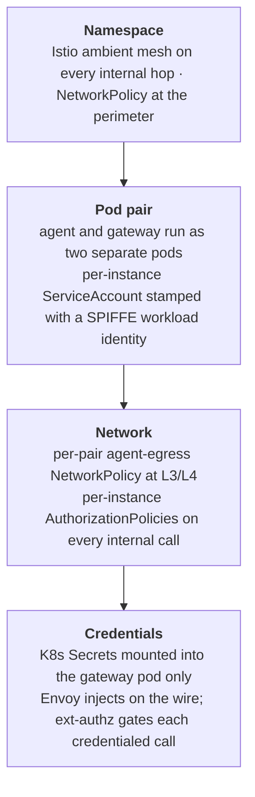
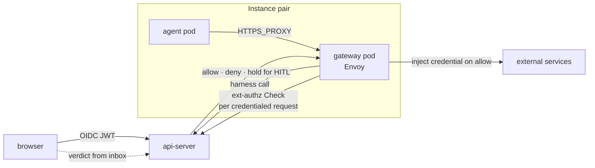

# Security overview

How Platform isolates agents from each other, from the cluster, and
from the credentials they use to reach external services.

## Layers of defence

Isolation is layered, with each layer doing one job:

The mesh layer gives every workload a cryptographic name, so admission
decisions are made on identity rather than IP or port. The pod-pair
layer puts the credential boundary at a real Linux boundary — the
agent process and the gateway process are in different pods, with
different kernels' view of the world. The network layer is structural
defence in depth: even if the agent process tried to ignore
`HTTPS_PROXY` and dial out directly, the kernel refuses. And the
credential layer means the agent never holds a real upstream token in
the first place — Envoy holds them, and only on the wire.

## Trust boundary

Every internal hop carries a SPIFFE identity stamped by istiod, and
every admission is gated on it.

Three AuthorizationPolicies per instance form the cryptographic
boundary: gateway admission, the harness path on the api-server, and
the per-instance ext-authz Service. Each is keyed on the per-instance
ServiceAccount, so peer instances are denied at the mesh — they can
resolve the address but the call never lands.

On top of that boundary, every credentialed request runs through a
second gate. An Envoy filter on the gateway makes a gRPC ext-authz
Check to the api-server before injecting a credential, with the
calling instance proven cryptographically by the ServiceAccount on
the connection. The api-server matches the request against the
instance's egress rules and answers allow, deny, or hold-open. A
held-open Check waits while the owner approves or denies the egress
from the inbox in the UI; if the verdict is deny — or none arrives —
the Check fails closed and the agent gets a 403 with no credential
ever injected. Fork pairs (per-turn Slack threads) get their own
ServiceAccount and narrower policies on top.

## Threats and mitigations

| Threat | Mitigation |
|---|---|
| Agent steals an upstream token | Credentials live only in the gateway pod; Envoy injects them on the wire and the agent sees no real token |
| Agent escalates via its ServiceAccount token | `automountServiceAccountToken: false` on both pods — istiod issues the workload cert without a mounted SA-token |
| Agent reaches a peer instance's gateway | Per-instance AuthorizationPolicy denies traffic from any non-matching ServiceAccount |
| Agent bypasses the proxy to call external hosts directly | Per-pair agent-egress NetworkPolicy restricts L3/L4 egress to DNS, the paired gateway, and the ambient mesh |
| Route-confusion exfil through the gateway | Per-host Envoy filter chains pinned to each credential's host, with SAN-bound upstream TLS validation |
| Cross-tenant fork access to parent surface | Per-fork ServiceAccount; fork policies admit only the parent's MCP path |
| Direct pod-IP bypass of the api-server | Pod-level DENY AuthorizationPolicy admits only the waypoint's SA (harness) or a per-instance SA (ext-authz) |

## See also

- [security-and-credentials](../architecture/security-and-credentials.md) — current-state architecture details
- [security-model](security-model.md) — narrative framing of the three risks: execution, credentials, confidentiality
