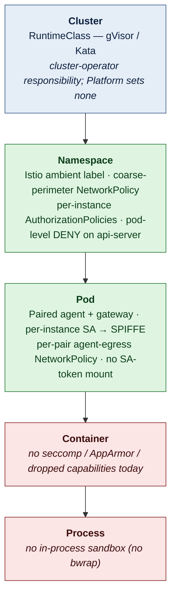
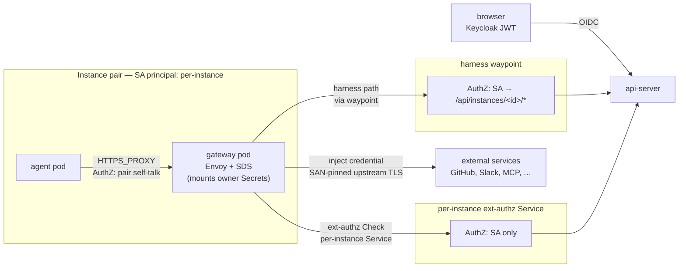
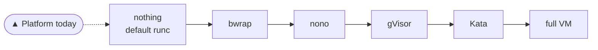
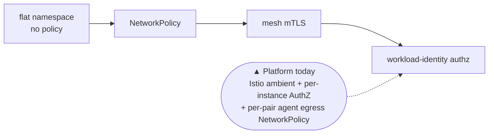

# Security overview

A single-page synthesis of where Platform sits on the security spectrum
today: what isolation each layer provides, what it does *not* provide,
and where the architecture would progress to get stronger guarantees.

This page is forward-looking and crosses subsystems. The companion
[security-model](security-model.md) frames the *why* (execution,
credentials, confidentiality) for product and security readers; this
page maps the *what* of today's stack and the gaps it acknowledges.
The current-state authority is
[`docs/architecture/security-and-credentials.md`](../architecture/security-and-credentials.md)
— this page links there rather than restating it.

## Isolation levels

What enforces isolation at each level of the stack:

Green bands are mechanisms Platform owns end-to-end. Blue is cluster-
operator responsibility Platform documents and assumes but cannot
enforce. Red bands mark gaps the architecture acknowledges today —
progression along the spectrum (below) means moving these one step
right.

## Trust boundary and data flow

Every internal hop carries a SPIFFE identity stamped by istiod; every
admission is gated by an AuthorizationPolicy keyed on that identity.

Three AuthorizationPolicies per instance form the cryptographic
boundary: gateway admission, harness path-prefix at the waypoint, and
the per-instance ext-authz Service. Fork pairs (ADR-027) get their own
SA and narrower per-fork policies layered on top. The per-pair
NetworkPolicy on agent egress is structural defence-in-depth: it stops
a misbehaving agent from side-stepping `HTTPS_PROXY` at the kernel
layer, independent of mesh AuthZ.

## Isolation spectrum

Two axes describe the posture: how strongly the runtime contains
broken-out code, and how tightly the network constrains where the
agent can reach.

**Execution sandboxing** — what stands between a compromised process
and the host kernel:

Platform itself sets no RuntimeClass and applies no in-process
sandbox. Stronger runtimes (gVisor, Kata) are a cluster-operator
decision Platform documents and assumes but cannot enforce — see
[security-model § Execution](security-model.md#execution).

**Network isolation** — what constrains where an agent's traffic can
go:

The execution and network axes move independently. Platform's
posture is asymmetric by design: weak on execution sandboxing
(deferred to the cluster), strong on network and identity (owned by
the chart).

## Threats today

Every row traces to an accepted ADR or to the architecture page; no
novel claims are introduced here.

| Threat | Current mitigation | Residual risk | Where it would be addressed |
|---|---|---|---|
| Agent steals upstream token | Credential boundary at the pod: Secrets mounted into gateway pod only; Envoy injects on the wire ([ADR-005](../adrs/005-credential-gateway.md), [ADR-033](../adrs/033-envoy-credential-gateway.md)) | Gateway-pod compromise yields credentials in memory | Cluster-level kernel isolation (gVisor/Kata); Envoy CVE cadence |
| Agent escalates via SA token | `automountServiceAccountToken: false` on both pods of the pair; istiod issues workload cert independently | None material at K8s API surface | — |
| Agent reaches a peer instance's gateway | Per-instance AuthorizationPolicy on gateway admission, keyed on SA principal ([ADR-041](../adrs/041-istio-ambient-mesh.md)) | ztunnel / istiod bugs | Mesh CVE tracking |
| Agent bypasses `HTTPS_PROXY` to dial external hosts directly | Per-pair agent-egress NetworkPolicy (`<id>-agent-egress`) restricts L3/L4 egress to DNS, paired gateway, and ambient HBONE | DNS tunnelling; abuse of the paired gateway itself | ext-authz HITL on credentialed egress ([ADR-035](../adrs/035-unified-hitl-ux.md)); allow-listing |
| Route-confusion exfil through the gateway | Per-host filter chains pinned to credential host; SAN-bound upstream TLS validation ([ADR-033 §Threat Model](../adrs/033-envoy-credential-gateway.md#threat-model)) | None structural | — |
| Cross-tenant fork access to parent surface | Per-fork SA; per-fork AuthorizationPolicies admit fork SA only to `/api/instances/<parent>/mcp` and the parent's ext-authz Service ([ADR-041](../adrs/041-istio-ambient-mesh.md)) | None material | — |
| Direct pod-IP bypass of the waypoint | Pod-level DENY AuthorizationPolicy on api-server: only the waypoint's SA (harness) or a per-instance SA from agent ns (ext-authz) is admitted | None material | — |
| Container escape to the node | *No Platform mitigation* — default runc | Full node compromise if a kernel CVE is exploitable | Cluster-level RuntimeClass (gVisor/Kata) provisioned by the operator |
| Envoy data-path CVE | Upstream Envoy patch cadence (managed by Istio releases) | Window between disclosure and patch | Sandboxed runtime as defence in depth, if the cluster provides one |
| Confidentiality / prompt-injection exfil | Outbound surface narrowing via ext-authz HITL on credentialed egress; egress NetworkPolicy on non-credentialed traffic | No reliable mitigation industry-wide (see [security-model § Confidentiality](security-model.md#confidentiality)) | Open research problem (CaMeL-style dirty-data tracking, Rule of Two) |

## Staged progression

The position on the spectrum is intentionally uneven: the identity
and credential layers are strong because Platform owns them
end-to-end; the runtime sandboxing layer is weak because Platform
runs on whatever the cluster provides and cannot enforce a stronger
runtime from inside the chart.

**Where Platform sits today**

- Strong workload identity on every internal hop (SPIFFE via Istio
  ambient, [ADR-041](../adrs/041-istio-ambient-mesh.md)).
- Strong credential boundary at the pod (paired-pod topology with
  Envoy SDS, [ADR-005](../adrs/005-credential-gateway.md),
  [ADR-033](../adrs/033-envoy-credential-gateway.md),
  [ADR-038](../adrs/038-paired-gateway-pod.md)).
- Coarse but correct network controls (per-pair egress NetworkPolicy,
  three per-instance AuthorizationPolicies, pod-level DENY on the
  api-server).
- Confidentiality controls limited to outbound-surface narrowing via
  HITL ([ADR-035](../adrs/035-unified-hitl-ux.md)).

**Named gaps the architecture acknowledges**

- *Kernel isolation.* Platform assumes the cluster operator provides
  gVisor or Kata via RuntimeClass; the chart sets no RuntimeClass and
  the docs are explicit that without one, a kernel-CVE breakout
  reaches the node.
- *Container-level hardening.* The agent and gateway pods carry no
  seccomp profile, no AppArmor profile, and no dropped capabilities
  today. `readOnlyRootFilesystem` is also off on agent containers.
- *Process-level sandboxing.* No bwrap or equivalent inside the
  agent container — every tool the agent invokes runs with the same
  privileges as the agent process.
- *Confidentiality.* No general defence against prompt-injection
  exfiltration along legitimate egress paths beyond shrinking the
  outbound surface.

Progression along the spectrum means moving each of these gaps one
step right on the diagrams above. The order is a future decision,
not a commitment of this document.

## References

- [`docs/architecture/security-and-credentials.md`](../architecture/security-and-credentials.md) — current-state architecture, authoritative for *how*
- [security-model](security-model.md) — narrative framing of the three risks (execution, credentials, confidentiality)
- [multi-player](multi-player.md) — identity, ownership, per-user credential isolation
- ADRs: [005](../adrs/005-credential-gateway.md), [033](../adrs/033-envoy-credential-gateway.md), [035](../adrs/035-unified-hitl-ux.md), [038](../adrs/038-paired-gateway-pod.md), [041](../adrs/041-istio-ambient-mesh.md)
